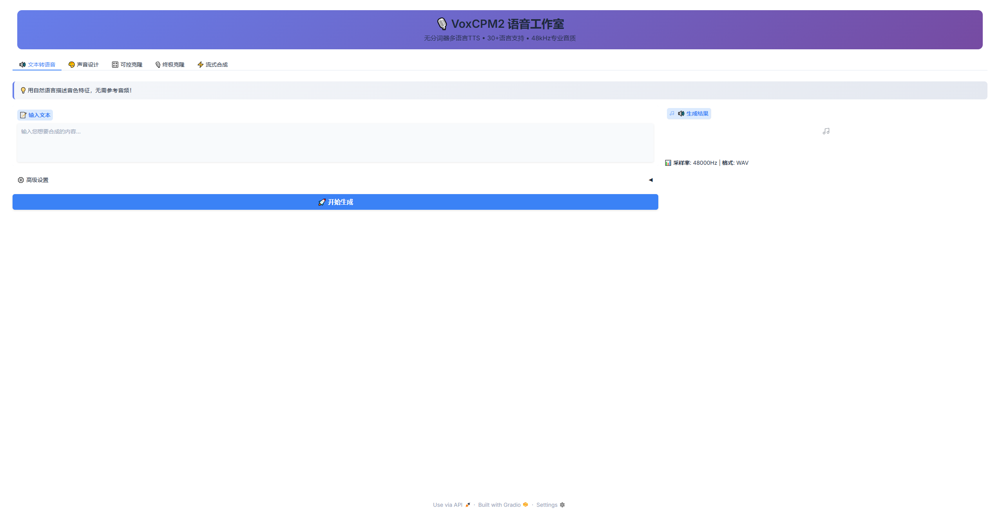
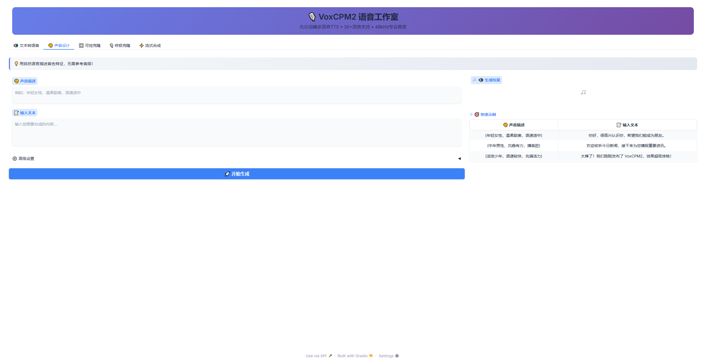
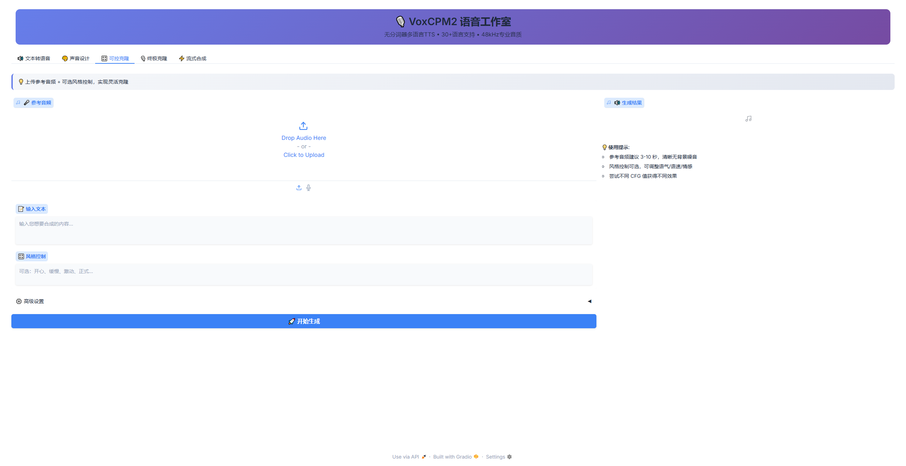
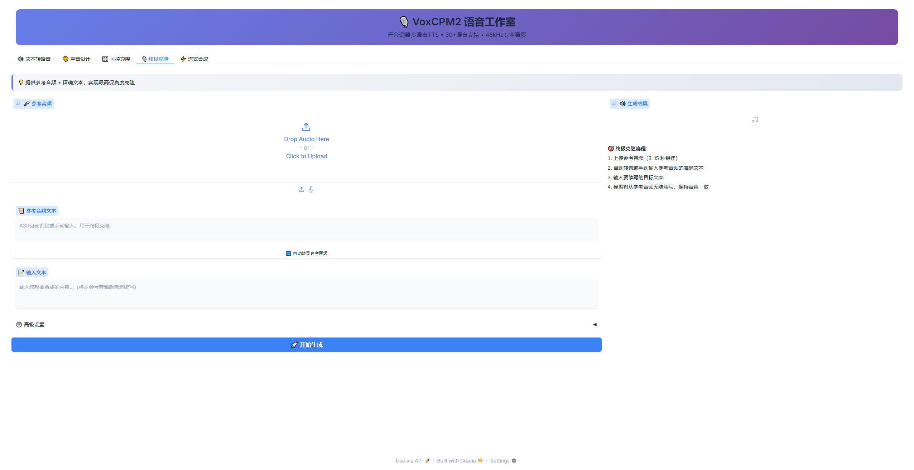
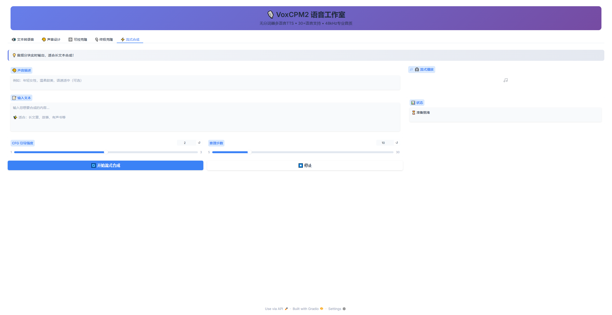

# VoxCPM-UI

> 这是一个AI生成的界面，专门用于VoxCPM2推理。

## 快速开始

1. pip安装gradio;
2. 复制 web_ui.py 文件到你需要的目录（修改文件中的变量为你自己的）;
3. 启动.

## 简单说明

1. 默认使用本地路径加载模型；
2. 完整实现了官方所述的功能点；
3. 没有配置加速。

## 页面效果

## 感谢

感谢 [https://github.com/OpenBMB](https://github.com/OpenBMB) 团队的工作。

## 版权

GPL 3.0
